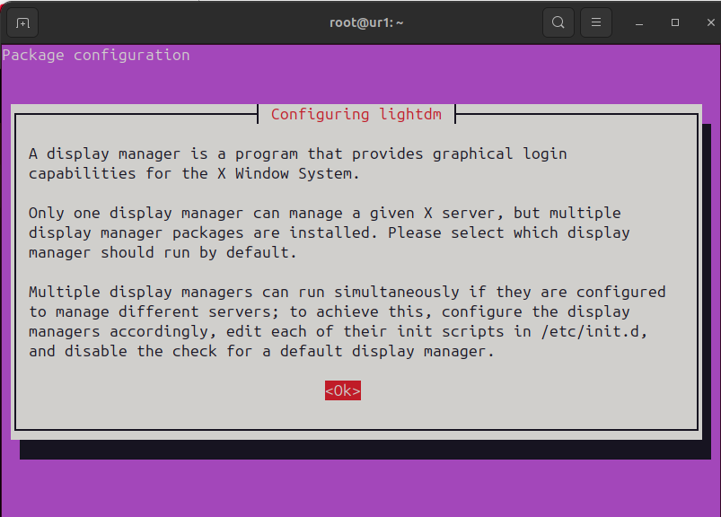
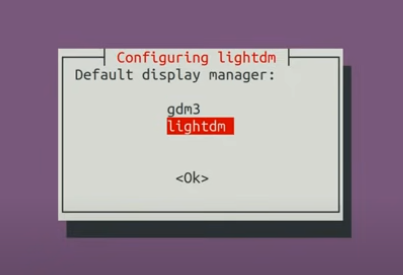
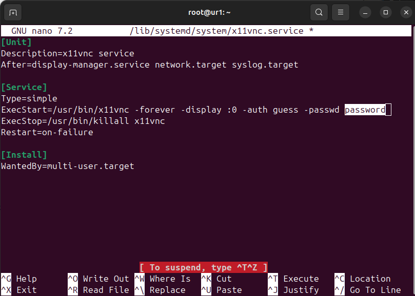
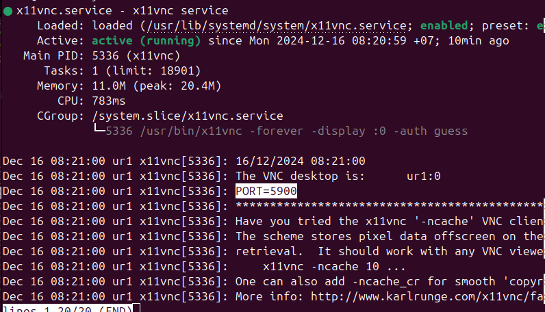
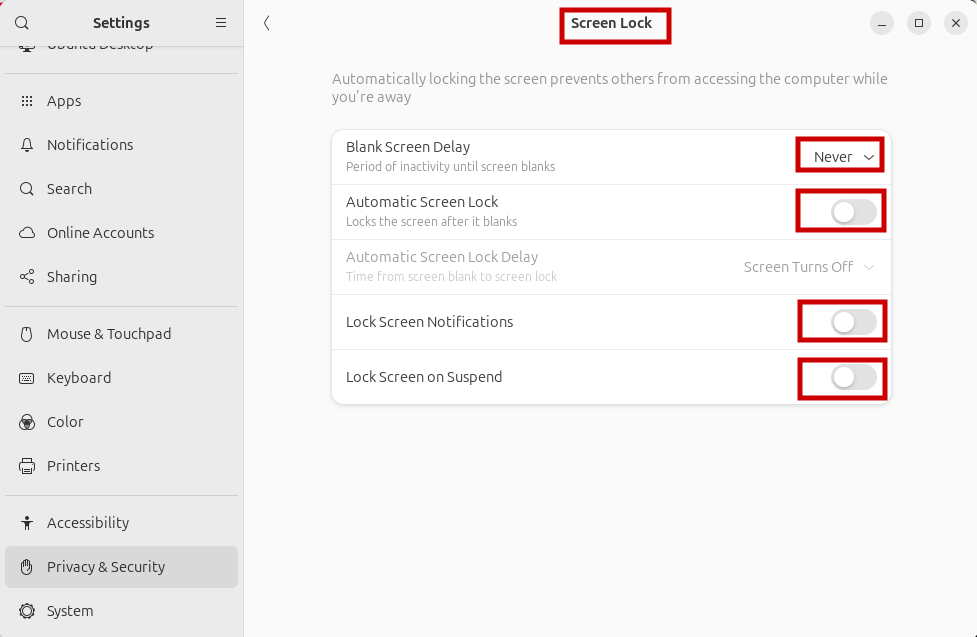

# Remote-ubuntu-vnc-lightdm-x11vnc
Hướng Dẫn Cài Đặt X11VNC và LightDM Trên Ubuntu

## I. Cập nhật Ubuntu
```
sudo apt-get update && upgrade
```
 )

## II. Cài đặt lightdm
### Thực hiện câu lệnh cài đặt lightdm

```
sudo apt-get install lightdm -y
```






>[Enter] &#8594; [Down] &#8594; [Enter]

Kiểm tra cài đặt thành công lightdm
```
lightdm --version
```
ví dụ: lightdm 1.30.0

Khởi động lại hệ thống
```
sudo reboot
```
 <span style="color: #CECC8C; font-weight: bold;">Câu lệnh này sẽ khởi động lại máy, hãy lưu các dữ liệu quan trọng trước khi thực hiện !!!</span>

## III. Cài đặt x11vnc
### 1. Thực hiện câu lệnh cài đặt x11vnc
```
sudo apt-get install x11vnc -y
```

Kiểm tra cài đặt thành công x11vnc

```
x11vnc -version 
```
Ví dụ: x11vnc: 0.9.16 lastmod: 2020-12-15
### 2. Cau hinh x11vnc
Truy cập thư mục cấu hình

```
sudo nano /lib/systemd/system/x11vnc.service
```

Sao chép đoạn code và thay đổi 'password' bằng mật khẩu của bạn
```
[Unit]
Description=x11vnc service
After=display-manager.service network.target syslog.target

[Service]
Type=simple
ExecStart=/usr/bin/x11vnc -forever -display :0 -auth guess -passwd password
ExecStop=/usr/bin/killall x11vnc
Restart=on-failure

[Install]
WantedBy=multi-user.target
```




>[ Ctrl + x ] &#8594; [ y ] &#8594; [ Enter ]


Khởi động x11vnc
```
systemctl daemon-reload
```

```
systemctl enable x11vnc.service
```

```
systemctl start x11vnc.service
```

```
systemctl status x11vnc.service
```

Hình ảnh cài đặt thành công x11vnc



Note: port 5900 là cổng để bạn kết nối

Nếu không thành công, kiểm tra lỗi bằng cách
```
x11vnc -display :0
```

### 3. Thiết lập trạng thái không ngủ cho máy

>Setting &#8594; Privacy & Security




Note: ở chế độ này máy tính sẽ không tự động khóa màn hình

## IV. Thiết lập Network
### 1. Mạng private 
Nếu bạn sử dụng cùng một mạng thì đây là cách bạn có thể kết nối

```
sudo apt install net-tools -y
ip -a
```

Hình ảnh ví dụ
aaaaaaa

Như ở đây chúng ta có thể thấy 
