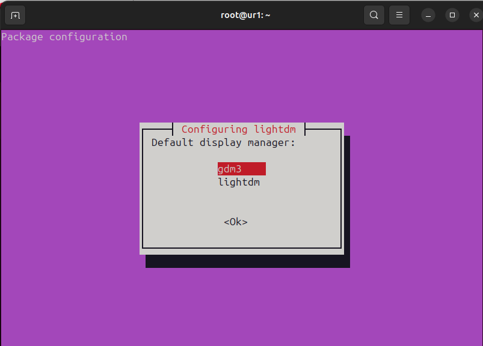
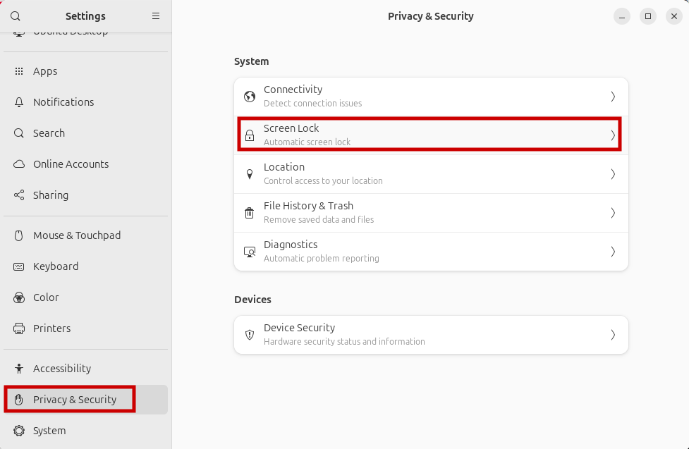

# Remote-ubuntu-vnc-lightdm-x11vcn
Hướng Dẫn Cài Đặt X11VNC và LightDM Trên Ubuntu

## I. Cập nhật Ubuntu
```
sudo apt-get update && upgrade
```
 <span style="color: #CECC8C; font-weight: bold;">Bạn cần nhập mật khẩu khi sử dụng câu lệnh ở chế độ root (sudo)</span>

## II. Cài đặt lightdm
### Thuc hien cau lenh sau de cai dat lightdm

```
sudo apt-get install lightdm -y
```





>[Enter] &#8594; [Down] &#8594; [Enter]

Kiem tra cai dat thanh cong lightdm
```
lightdm --version
```
vi du: lightdm 1.30.0

Khoi dong lai he thong
```
sudo reboot
```
 <span style="color: #CECC8C; font-weight: bold;">Câu lệnh này sẽ khởi động lại máy, hãy lưu các dữ liệu quan trọng trước khi thực hiện !!!</span>

## III. Cài đặt x11vnc
### 1. Thuc hien cau lenh sau de cai dat x11vnc
```
sudo apt-get install x11vnc -y
```

Kiem tra da cai dat thanh cong

```
x11vnc -version 
```
vi du: x11vnc: 0.9.16 lastmod: 2020-12-15
### 2. Cau hinh x11vnc
Truy cap duong dan bang cach nhap cau lenh

```
sudo nano /lib/systemd/system/x11vnc.service
```

Sao chep doan code thay doi password bang mat khau cua ban
```
[Unit]
Description=x11vnc service
After=display-manager.service network.target syslog.target

[Service]
Type=simple
ExecStart=/usr/bin/x11vnc -forever -display :0 -auth guess -passwd password
ExecStop=/usr/bin/killall x11vnc
Restart=on-failure

[Install]
WantedBy=multi-user.target
```


>[ Ctrl + x ] &#8594; [ y ] &#8594; [ Enter ]


Khoi dong x11vnc
```
systemctl daemon-reload
```

```
systemctl enable x11vnc.service
```

```
systemctl start x11vnc.service
```

```
systemctl status x11vnc.service
```

Hinh anh khi x11vnc cai dat thanh cong


Note: port 5900 la port de ban ket noi
Neu khong thanh cong hay kiem tra log cua x11vnc nhu sau

```
x11vnc -display :0
```

### 3. Thiet lap khong ngu cho may tinh
o che do nay may tinh se khong tu khoa man hinh

>Setting &#8594; Privacy & Security




